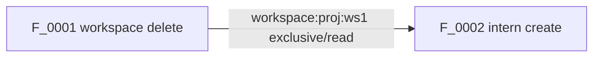

# CI Architecture Redesign

## Status

Implemented in task416 through Session 109 final audit.

This document defines the CI architecture after the current F/J case expansion.
It intentionally removes the old c-series as a first-class test type. Existing
c-series files were treated as migration material only: useful scenarios were
re-authored as F or J; the rest were retired.

## Goals

- Keep only two official case types: F and J.
- Make F and J both script-driven user stories.
- Keep F free of agent chat and LLM cost.
- Keep J for real agent work, real user prompts, context continuation, and skill use.
- Split case scripts, actions, assertions, helpers, planner, runner, and reports into clear modules.
- Replace ad hoc `parallel_safe` scheduling with explicit resource locks and a conflict graph.
- Make every selected run explainable before execution: selected cases, required resources, conflicts, scheduling waves, and skipped/serialized reasons.
- Decompose `native_remote.py`; new case logic belongs in helpers, actions, assertions, and case scripts, not in the monolithic executor.
- Execute stages sequentially, while each stage runs as much as it safely can in parallel.

## Non-Goals

- No product behavior changes in the CI refactor.
- No report schema break in the first migration phase.
- No simultaneous rewrite of every existing F case.
- No direct push to `master`; migration continues through MR.
- No relay restart outside explicitly requested deploy/test stages.
- No rendered graph images in the default flow. Planner emits graph source artifacts only.
- No new-machine provisioning in the main CI flow. Existing debug-a/debug-b are the default execution environment; new-machine scripts stay available as an explicit non-default path.
- No backward-compatible interpretation of old case metadata fields. New F/J cases must satisfy the new contract directly.

## Decisions

- Official case types are only F and J.
- Old c-series files are not a target architecture concept. Useful scripts may be migrated into F/J; otherwise they are retired.
- Feishu groups are retained by default after a case finishes, so supervisors can inspect the scene.
- Each case must run a start-of-case cleanup for its own namespace before it creates new resources. This removes stale groups/resources from previous runs, then the current run's group is left in place unless the script explicitly tests deletion.
- Conflict graph output is text/source only: JSON plus DOT/Mermaid. Graph rendering can be added later if needed.
- The primary machine profile reuses current `debug-a` and `debug-b`. New machine provisioning remains as a script/profile outside the main path.
- Stages run in order. Parallelism is allowed only inside a stage and only after the planner proves selected cases/actions do not conflict.
- The planner reads `resource_locks` only. Old `resources` fields, aliases, or shorthand strings are not translated.

## Terminology

### F Case

F is a deployment capability story that does not trigger an agent to work.

Allowed:

- CLI behavior.
- GUI button/menu/TreeView behavior through CLI-equivalent or event simulation.
- Relay/daemon APIs.
- Real Feishu group/card/message surfaces when they do not cause an agent turn.
- Visible simulated messages such as `[CI模拟] user clicked Save` so the Feishu scene is readable.
- Runtime/session health checks that do not require an agent response.

Not allowed:

- User prompt that asks Codex/Claude to think or act.
- Assertions that depend on LLM text generation.
- Paid LLM calls.

### J Case

J is a real journey with agent work.

Required:

- Real user prompt or real user action that starts agent work.
- Real Codex/Claude session behavior.
- User-visible Feishu or GUI journey evidence.
- Explicit retained scene. If the journey intentionally deletes the intern/group, the report must explain that deletion is part of the script.

Examples:

- User says `hi`, waits for agent reply, exits, resumes, and verifies same session id.
- User asks Claude to use a skill and validates the result.
- User drives a task through prompt, PR, review, and merge.

## Target Directory Layout

```text
intern-cli/CI/
  run_ci.py
  helpers/
    mock_feishu_helper.py
    mock_treeview_helper.py
    product_cli_helper.py
    remote_machine_helper.py
    source_contract_helper.py
  actions/
    __init__.py
    registry.py
    workspace.py
    intern.py
    session.py
    feishu.py
    treeview.py
    policy.py
    relay_daemon.py
    source_contract.py
  assertions/
    __init__.py
    registry.py
    core.py
    workspace.py
    intern.py
    session.py
    feishu.py
    treeview.py
    policy.py
    source_contract.py
  cases/
    __init__.py
    base.py
    registry.py
    selector.py
    resources.py
    F/
      F_0001.py
      ...
    J/
      J_0001.py
      ...
  docs/
    F/
    J/
    CI_ARCHITECTURE_DESIGN.md
  runner/
    __init__.py
    stage_0_preflight.py
    stage_1_unit_test.py
    stage_2_package_deploy.py
    stage_3_F.py
    stage_4_J.py
    planner.py
    scheduler.py
    reporting.py
    runner.py
  tests/
    test_case_registry.py
    test_resource_planner.py
    test_stage_runner.py
    test_helpers.py
```

Migration boundary:

- The compatibility migration is complete as of Session 109. Existing
  transitional paths such as `CI/runner.py`, `CI/native_remote.py`,
  `CI/selection.py`, `CI/stage_preflight.py`, `CI/remote_case_runner.py`, and
  `CI/cases/F/remote_*.py` are not active compatibility contracts.
- New code must go under the target layout or the current equivalent path when
  a target package name would conflict with an existing module.
- F/J case metadata must satisfy the current contract directly. The target
  pipeline does not translate legacy `resources`, c-series ids, or removed
  `case_slots` metadata.
- `case_slots/c_*.py`, `case_slots/F`, and `case_slots/J` are not part of the
  target repository layout.

## Module Responsibilities

### `run_ci.py`

The only public CLI entrypoint.

Responsibilities:

- Parse CLI arguments.
- Load case registry.
- Choose stages.
- Call `runner.runner.run_pipeline()`.
- Emit high-level report path and exit code.

It should not contain scheduling, deploy implementation, action implementation, or case logic.

Required command shapes:

```bash
# Full run
python3 intern-cli/CI/run_ci.py --all

# Unit only
python3 intern-cli/CI/run_ci.py --stage unit

# Package/deploy only
python3 intern-cli/CI/run_ci.py --stage package_deploy

# Existing deployment, one F
python3 intern-cli/CI/run_ci.py --use-existing-deployment --stage F --case F_0036_machine_config_card_policy_sync_safety_contract

# Existing deployment, one J
python3 intern-cli/CI/run_ci.py --use-existing-deployment --stage J --case J_0033_codex_exit_resume_same_session_journey

# Existing deployment, F set
python3 intern-cli/CI/run_ci.py --use-existing-deployment --stage F --case-set workspace

# Plan only
python3 intern-cli/CI/run_ci.py --stage F --case-set F --dry-run --emit-conflict-graph
```

### `helpers/`

Helpers are adapters to product surfaces or external systems. They should make test scripts readable and keep low-level protocol details out of cases.

Helpers must not decide pass/fail. They return evidence for assertions.

#### `mock_feishu_helper.py`

Provides simulated Feishu operations.

Rules:

- Every simulated operation must send a visible message to the target test group before it triggers the product path.
- Message prefix should be stable, for example `[CI模拟]`.
- The visible script should read like a continuous user story.
- It can drive relay message handlers, card callback handlers, or real Feishu messages depending on case mode.
- It must record message ids, chat id, visible text, callback payload, and product response.
- It must not clean the group at the end of a normal case. Retained groups are evidence.
- It may clean previous run groups at the start of a case when the group name/chat id matches the case namespace.

Example visible sequence:

```text
[CI模拟] 用户发送 /machine_config
[CI模拟] 用户点击 Save
[CI模拟] 用户选择 cancel
```

This is still F if it does not cause an agent to start working.

#### `mock_treeview_helper.py`

Provides GUI event simulation.

Rules:

- Simulate command invocation, TreeItem click, context menu click, QuickPick choice, and input box submission.
- Record the GUI command id and CLI-equivalent path.
- Do not assert correctness directly.
- Return structured evidence that actions and assertions can consume.

#### `product_cli_helper.py`

Wraps `internctl.py`, `intern-adminctl.py`, and product CLIs.

Rules:

- Preserve stdout/stderr/returncode.
- Redact secrets.
- Keep exact argv evidence.

#### `remote_machine_helper.py`

Wraps remote SSH, tmux, daemon, relay, process, file, and artifact primitives.

Rules:

- No case-specific scenario logic.
- All cleanup must be explicit and namespaced.
- Case cleanup runs at the beginning of a case by default. End-of-case cleanup happens only when the script is explicitly testing deletion or resource cleanup behavior.
- No hidden fallback for missing product state.

#### `source_contract_helper.py`

Centralizes source and bundle scanning.

Rules:

- Source contract checks should be named and reusable.
- Regex scans must report the searched file, pattern intent, and source slice.
- Fragile minified-variable checks should be isolated here, not repeated in cases.

### `actions/`

Actions perform one operation and return evidence.

Rules:

- Actions may use helpers.
- Actions do not make final pass/fail decisions.
- Every action declares resource locks.
- Every action has a registry entry.
- Every action has a stable output schema.
- Case-specific actions are allowed only when the action is not reusable. The case file must explain why it is not promoted.

Action definition fields:

```python
ActionDefinition(
    id="workspace.delete",
    title="Delete workspace",
    category="capability",
    callable_path="CI.actions.workspace.delete_workspace",
    parameters=(...),
    resource_locks=(
        ResourceLock("workspace:{project}:{workspace_id}", mode="exclusive"),
        ResourceLock("relay:workspace_registry", mode="write"),
    ),
    returns="Workspace delete evidence with CLI, relay registry, and filesystem state.",
)
```

### `assertions/`

Assertions inspect evidence and decide pass/fail.

Rules:

- Assertions are pure checks.
- Assertions do not mutate product state.
- Assertions do not call product APIs except read-only probes when explicitly documented.
- Every assertion has a registry entry.
- Assertion failure must include expected behavior, actual behavior, evidence paths, and classification hint.

### `cases/`

Cases define scripts.

Rules:

- Only F and J are official.
- Case files are declarative and small.
- Case-specific action/assertion is allowed only with an inline rationale.
- Every case references a doc script in `docs/F` or `docs/J`.
- Every case declares `resource_locks` and scenario steps.
- Every case declares start cleanup and retained scene policy.
- The default retained scene policy is `retain`, including Feishu groups.
- The default cleanup policy is `start_only`, scoped to the case namespace.

Suggested case structure:

```python
CASE = CaseDefinition(
    id="F_0036_machine_config_card_policy_sync_safety_contract",
    stage="F",
    kind="machine_config_card_contract",
    doc_path="CI/docs/F/F_0036.md",
    llm_cost=False,
    visible_story=True,
    cleanup_policy="start_only",
    retained_scene_policy="retain",
    resource_locks=(
        ResourceLock("machine:debug-a", mode="exclusive"),
        ResourceLock("relay:policy", mode="write"),
        ResourceLock("feishu_chat:ci_f_0036", mode="exclusive"),
    ),
    steps=(
        Step(
            id="s01_open_machine_config",
            action="feishu.send_slash_command",
            input={"text": "/machine_config"},
            assertions=("feishu.card_visible",),
        ),
        Step(
            id="s02_save_machine_config",
            action="feishu.click_card",
            input={"button": "Save"},
            assertions=("policy.daemon_sync_sent", "policy.machine_config_state_saved"),
        ),
    ),
)
```

### `docs/`

Docs are the reviewable scripts.

Every F/J doc should include:

- User story.
- Cost profile: free/no-agent or paid/agent.
- Required environment.
- Resources.
- Step-by-step script.
- Expected visible Feishu/GUI scene.
- Assertions.
- Start cleanup policy.
- Retained scene policy.
- Product bug classification rules.

F and J docs should look similar. The difference is not script quality; the difference is whether the script triggers agent work.

### `runner/`

Runner owns execution stages, planning, scheduling, and report assembly.

Runner does not own product behavior or case details.

`run_ci.py` remains the only public CI CLI. Remote F/J execution is a runner
stage implementation detail: stage 3/4 may SSH to debug machines and invoke an
internal worker module there, but the repository must not grow a second public
`remote_run`-style entrypoint.

Stages are strictly sequential. A stage starts only after the previous selected stage passes or is explicitly skipped by command-line selection. Within a stage, scheduler may run selected cases in parallel only when the planner's resource graph proves the cases are compatible.

#### Stages

`stage_0_preflight.py`

- Validate registry.
- Validate F/J boundary.
- Validate action/assertion ids.
- Validate resource declarations.
- Build conflict graph.
- Emit plan artifacts.

`stage_1_unit_test.py`

- Run pytest/Jest/unit checks.
- No remote deploy.
- No Feishu scene.

`stage_2_package_deploy.py`

- Package extension and bundled CLI.
- Deploy to the existing debug-a/debug-b machines by default.
- Keep new-machine provisioning as a separate script/profile, not part of the main pipeline.
- Start relay, then daemons.
- Verify daemon pulls policy from relay.
- Verify Codex policy uses LB.
- Verify Claude policy uses opus 4.7.

`stage_3_F.py`

- Run selected F cases.
- Use no-agent cost guard.
- Allow visible Feishu/GUI scripts when no agent work is triggered.
- Support `--all`, `--case-set`, `--case`.

`stage_4_J.py`

- Run selected J cases.
- Allow paid LLM calls.
- Preserve user-visible journey evidence.
- Support `--all`, `--case-set`, `--case`.

`runner.py`

- Compose the selected stages.
- Pass plan to scheduler.
- Aggregate reports.
- Own top-level exit code.

## Resource Lock Model

The planner must build a conflict graph from the selected cases before execution.

### Resource Names

Resources use stable hierarchical names:

```text
global:relay
machine:debug-a
daemon:debug-a
relay:policy
relay:workspace_registry
workspace:<project>:<workspace_id>
intern:<project>:<intern_name>
session:<project>:<intern_name>
feishu_chat:<chat_id_or_case_namespace>
repo:<provider>:<repo_id>
branch:<provider>:<repo_id>:<branch>
artifact:<run_id>:<case_id>
```

Case-scoped generated resources should use `ci_f_XXXX` or `ci_j_XXXX`.

### Lock Modes

```text
read       compatible with read
write      conflicts with write and exclusive; conflicts with read unless marked snapshot-safe
exclusive  conflicts with all modes on the same resource
```

Default rule:

- Unknown resources are exclusive.
- Missing resource declarations fail preflight for F/J.
- Broad resources conflict with child resources. Example: `workspace:proj:*` conflicts with `workspace:proj:ws_1`.

### Conflict Examples

Workspace delete vs intern create:

```text
case A step workspace.delete:
  workspace:proj:ws_1 exclusive
  relay:workspace_registry write

case B step intern.create:
  workspace:proj:ws_1 read
  intern:proj:intern_a exclusive
  relay:chat_registry write

Conflict:
  workspace:proj:ws_1 exclusive vs read
```

Machine policy sync vs daemon reconnect:

```text
case A:
  relay:policy write
  daemon:debug-a write

case B:
  daemon:debug-a exclusive

Conflict:
  daemon:debug-a write vs exclusive
```

Independent case-scoped workspaces:

```text
F_0001 workspace:ci_f_0001 read/write
F_0002 workspace:ci_f_0002 read/write

No conflict if relay/global resources are only read or if registry writes are serialized at action level.
```

### Conflict Graph Output

For every dry-run and run with selected cases, planner should emit:

```text
report_dir/
  plan.json
  conflict_graph.json
  conflict_graph.dot
  conflict_graph.mmd
  schedule_waves.json
```

The planner does not render graph images by default. `conflict_graph.dot` and `conflict_graph.mmd` are source artifacts for review. PNG/SVG rendering can be added behind an explicit option later.

`conflict_graph.json`:

```json
{
  "nodes": [
    {"case_id": "F_0001", "resource_locks": [{"resource": "workspace:proj:ws1", "mode": "exclusive"}]}
  ],
  "edges": [
    {
      "left": "F_0001",
      "right": "F_0002",
      "reason": "workspace:proj:ws1 exclusive vs read",
      "resource": "workspace:proj:ws1"
    }
  ]
}
```

`conflict_graph.mmd`:



`schedule_waves.json`:

```json
{
  "waves": [
    {"wave": 0, "cases": ["F_0001", "F_0003"]},
    {"wave": 1, "cases": ["F_0002"]}
  ]
}
```

The first implementation can schedule at case granularity. Step-level scheduling can be added later if needed, but the conflict graph should preserve step-level reason data from the beginning.

## Report Model

Top-level report should include:

- selected cases.
- selected stages.
- package/deploy revision.
- policy evidence.
- plan artifacts.
- conflict graph artifacts.
- schedule waves.
- per-case visible story.
- per-step action evidence.
- per-step assertion evidence.
- product bug aggregate.
- retained scene references.
- start cleanup evidence.

Per case:

```json
{
  "case_id": "F_0036...",
  "stage": "F",
  "llm_cost": false,
  "visible_story": [
    {"time": "...", "surface": "feishu", "text": "[CI模拟] 用户点击 Save"}
  ],
  "cleanup_policy": "start_only",
  "retained_scene_policy": "retain",
  "resource_locks": [...],
  "steps": [...],
  "scenario_summary": {"total": 20, "passed": 19, "failed": 1},
  "failure_classification": "product_bug"
}
```

## F/J Boundary Enforcement

Preflight should enforce:

- F case must set `llm_cost=False`.
- F action list cannot include `agent.prompt`, `agent.wait_reply`, `agent.skill_use`, or equivalent paid actions.
- J case must set `llm_cost=True` or explicitly explain why it is a real journey without paid model usage.
- Feishu group usage alone does not make a case J.
- GUI usage alone does not make a case J.
- Agent work is the boundary.

## Migration Plan

Detailed execution order is tracked in `CI_MIGRATION_EXECUTION_PLAN.md`. This section describes the target phases; the execution plan defines batch boundaries, adapter strategy, and verification gates.

### Phase 0: Design Lock

- Review this design.
- Agree on directory names and F/J boundary.
- Agree on resource lock schema.

### Phase 1: Planner Without Behavior Change

- Add `cases/resources.py`.
- Add `runner/planner.py`.
- Generate `plan.json`, `conflict_graph.json`, `conflict_graph.dot`, `conflict_graph.mmd`, `schedule_waves.json`.
- Keep current runner execution unchanged.
- Run planner over current active F to inspect conflict graph.

### Phase 2: Registry Cleanup

- Move selection logic into `cases/selector.py`.
- Make target registry load only `cases/F` and `cases/J`.
- Remove `case_slots/c_*.py`, `case_slots/F`, and `case_slots/J` from the active repository layout.
- Re-author useful c-series stories into F/J or leave them retired.

### Phase 3: Helpers and Actions

- Add `helpers/mock_feishu_helper.py`.
- Add `helpers/mock_treeview_helper.py`.
- Move product CLI and remote machine wrappers out of `native_remote.py`.
- Add resource locks to action registry.

### Phase 4: Assertions

- Move reusable native assertions out of `native_remote.py`.
- Ensure every assertion is pure and registered.
- Keep case-specific assertion only with rationale.

### Phase 5: Stage Runner Split

- Add `runner/stage_0_preflight.py`.
- Add `runner/stage_1_unit_test.py`.
- Add `runner/stage_2_package_deploy.py`.
- Add `runner/stage_3_F.py`.
- Add `runner/stage_4_J.py`.
- Keep the public CI invocation shapes stable where they match the F/J pipeline; do not preserve deprecated case metadata formats.

### Phase 6: Remote Executor Decomposition

- Remove `native_remote.py` from the active CI runtime.
- Move case implementations into F/J case actions and helpers.
- Replace the monolithic `NativeRemoteCase` object with a small remote context plus domain runner modules.
- Keep report schema stable.

### Phase 7: Documentation and Tests

- Update `AUTHORING.md`.
- Update `README.md`.
- Add planner tests.
- Add helper tests.
- Add stage runner tests.
- Add migration guide for old c-series.

## Acceptance Criteria

- `run_ci.py --dry-run --stage F --case-set F --emit-conflict-graph` emits selected cases, conflict graph, and waves.
- Current active F can be planned without executing product behavior.
- Planner emits graph source artifacts but does not render graph images by default.
- Planner identifies known conflicts such as workspace delete vs intern create.
- F/J registry has no dependency on `case_slots/F`, `case_slots/J`, or c-series.
- F and J docs both present scripts.
- F preflight rejects paid agent actions.
- J preflight requires real journey semantics.
- Action and assertion registries expose resources and lock requirements.
- `native_remote.py` is deleted, and active remote execution imports the replacement context/runner modules directly.
- Feishu groups are retained by default, and each case performs start-of-case namespace cleanup.
- Stage execution is sequential, and only stage-internal safe parallelism is allowed.

## Open Questions

- Whether step-level scheduling is worth implementing in the first planner version or only preserving step-level conflict reasons.
